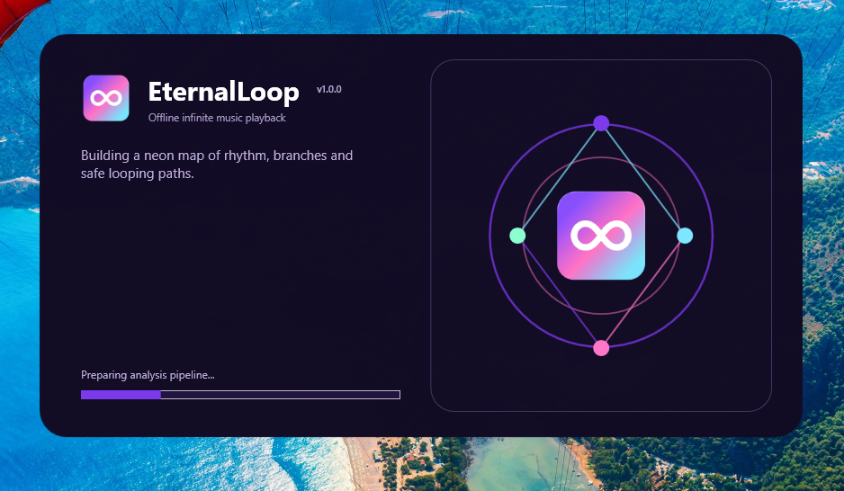
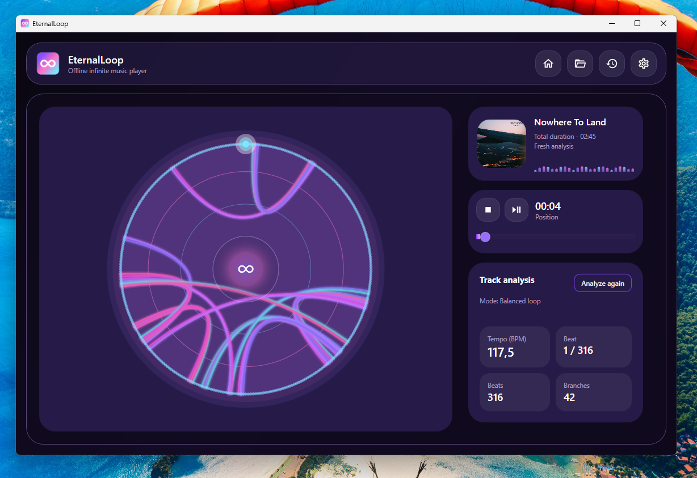
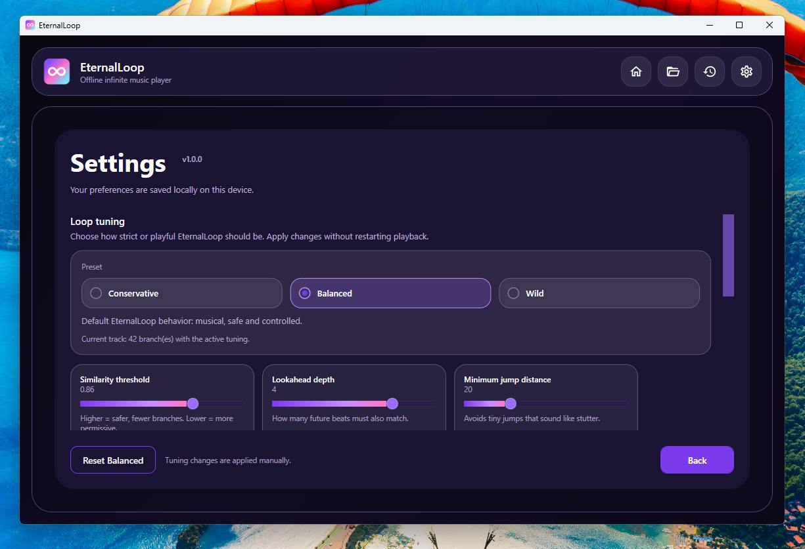

<p align="center">
  
</p>

<h1 align="center">
  EternalLoop For Windows (1.0.0)
</h1>

<p align="center">
  A local infinite music player that analyzes your songs and creates smooth loop branches automatically.
</p>

<p align="center">
  <a href="https://micilini.com/apps/eternalloop" target="_blank">
    
  </a>
</p>

<p align="center">
  
  
  
  
  
</p>

---

> EternalLoop is a Windows-native infinite music player that analyzes local audio files, detects beats, builds musical branch points, and keeps playback looping without relying any kind of external API.

---

# EternalLoop

EternalLoop turns local music files into an infinite listening experience.

It analyzes your track, detects beats, extracts audio features, finds musically compatible jump points, and plays the song through a local jukebox engine designed to avoid harsh cuts, repeated jumps, dead-end branches, and obvious phrase restarts.

The application is built for offline use. Your audio stays on your machine, analysis results are cached locally, and tuning presets let you choose between safer or more active loop behavior.

<p align="center">
  
</p>

<p align="center">
  
</p>

<p align="center">
  
</p>

## Highlights

- Windows-native desktop app built with WPF and .NET 8.
- Fully local audio analysis and playback.
- Supports MP3, WAV, FLAC, M4A, and AAC files.
- Automatic beat tracking using spectral flux analysis.
- MFCC, chroma, RMS/loudness, and position-in-bar features.
- Chroma median filtering for cleaner pitch-class analysis.
- Self-similarity branch detection with adaptive thresholds.
- Phrase-safe branch validation to reduce “starts right, continues wrong” jumps.
- Musical landing offset to avoid jumping directly into the same repeated phrase.
- Metric-position penalty to reduce jumps that lose the downbeat.
- Anti-repeat branch cooldown to avoid getting stuck on the same jump.
- End-guard logic to keep playback from reaching the end of the track.
- Local analysis cache for faster reopening of previously analyzed songs.
- Recent tracks list.
- Track artwork extraction where available.
- Conservative, Balanced, and Wild tuning presets.
- Reanalysis option when you want to rebuild the loop map.
- High-quality neon circular visualization inspired by infinite jukebox-style branch maps.
- Single-instance mutex to prevent multiple app instances from running at the same time.
- Self-contained Windows release build support.

## Supported Audio Formats

| Format | Status | Notes |
|---|---|---|
| MP3 | Supported | Decoded locally through the Windows audio stack / NAudio |
| WAV | Supported | Read directly through NAudio |
| FLAC | Supported | Requires compatible Windows Media Foundation support |
| M4A | Supported | Requires compatible Windows Media Foundation support |
| AAC | Supported | Requires compatible Windows Media Foundation support |

Unsupported or corrupted audio files are rejected safely before analysis.

## How EternalLoop Works

```text
Local audio file
        │
        ▼
Audio loader / decoder
        │
        ▼
Mono conversion + resampling
        │
        ▼
Feature extraction
        ├─ MFCC / timbre
        ├─ Chroma / pitch classes
        ├─ RMS / loudness
        └─ Spectral flux
        │
        ▼
Beat tracking
        │
        ▼
Beat feature aggregation
        ├─ Timbre
        ├─ Pitches
        ├─ Loudness
        └─ Position in bar
        │
        ▼
Self-similarity matrix
        │
        ▼
Branch finder
        │
        ▼
Jukebox graph
        │
        ▼
Seamless playback engine
```

The result is a loop map that allows the player to jump from one beat to another compatible beat while trying to preserve musical continuity.

## Loop Intelligence

EternalLoop does not simply jump to any similar-looking point.

The current engine includes several safeguards designed to make branches feel more musical:

| System | Purpose |
|---|---|
| Musical landing offset | Uses a similar anchor point but lands slightly after it to reduce obvious phrase repetition |
| Loudness-aware scoring | Avoids jumps between sections with very different energy levels |
| Position-in-bar penalty | Reduces jumps that land on the wrong beat of the bar |
| Chroma median filtering | Reduces pitch-class noise and short harmonic spikes |
| Phrase continuation validation | Checks that the destination continues well after the jump |
| Adaptive branch thresholding | Prevents branch graphs from becoming overly dense |
| Jump safety filtering | Avoids dead-end and terminal branch routes |
| Anti-repeat cooldown | Prevents the same exact branch from repeating too often |
| End guard | Forces safe jumps near the end so playback can continue |

## Tuning Presets

EternalLoop includes three built-in loop behavior presets:

| Preset | Description |
|---|---|
| Conservative | Fewer jumps, stricter phrase matches, safest listening experience |
| Balanced | Default behavior focused on musical, controlled looping |
| Wild | More active jumping while still keeping safety checks enabled |

The settings screen lets you switch presets and adjust loop behavior without editing configuration files manually.

## Local Cache

EternalLoop saves analysis results locally so previously opened songs can load faster.

Cached analysis is stored under the user's local application data folder:

```text
%LocalAppData%\EternalLoop
```

The cache stores analysis data, not copies of your music files.

If the analysis model changes between versions, old cache entries can be ignored automatically and rebuilt the next time the track is opened.

## Screens

EternalLoop currently includes these main screens:

| Screen | Purpose |
|---|---|
| Splash Screen | Shows the app logo and version during startup |
| Welcome | Opens audio files and shows recent tracks |
| Analysis | Displays progress while audio is loaded, analyzed, and mapped |
| Player | Plays the infinite loop and shows the circular branch visualization |
| Settings | Lets you switch presets, adjust behavior, and manage local preferences |
| Recent Tracks | Provides quick access to previously opened files |

## Architecture Overview

```text
WPF application layer
        │
        ├─ Views
        ├─ ViewModels
        ├─ Navigation
        └─ UI services
        │
        ▼
Contracts
        ├─ Models
        ├─ Options
        ├─ Events
        ├─ Enums
        └─ Interfaces
        │
        ▼
Core
        ├─ Audio loading
        ├─ Feature extraction
        ├─ Beat tracking
        ├─ Similarity scoring
        ├─ Branch graph building
        ├─ Jukebox traversal engine
        ├─ Seamless audio playback
        ├─ Cache persistence
        └─ Settings persistence
```

The project is split into three main assemblies:

| Project | Responsibility |
|---|---|
| `EternalLoop.App` | WPF UI, navigation, view models, themes, splash screen, and app startup |
| `EternalLoop.Contracts` | Shared models, interfaces, options, events, enums, and product metadata |
| `EternalLoop.Core` | Audio loading, DSP, beat tracking, branch finding, playback, caching, and settings |

## Built With

- C# / .NET 8
- Windows Presentation Foundation (WPF)
- NAudio
- NWaves
- TagLibSharp
- MaterialDesignThemes
- MaterialDesignColors
- CommunityToolkit.Mvvm
- Microsoft.Extensions.Hosting
- Microsoft.Extensions.DependencyInjection
- Microsoft.Extensions.Logging

## How to Run Locally

Requirements:

- Windows 10 or 11 x64
- Visual Studio Community 2022 or newer
- .NET 8 SDK
- .NET desktop development workload
- Windows Media Foundation support for compressed audio formats

Steps:

1. Clone the repository.
2. Open the solution file in Visual Studio.
3. Restore NuGet packages.
4. Build the solution.
5. Run the WPF application with `F5`.

You can also run from the command line:

```powershell
dotnet restore .\EternalLoop.slnx
dotnet build .\EternalLoop.slnx --configuration Debug
dotnet run --project .\EternalLoop.App\EternalLoop.App.csproj
```

## Testing

Run the automated test suite with:

```powershell
dotnet test .\EternalLoop.slnx --configuration Debug
```

The test suite covers audio format detection, feature extraction, beat tracking, similarity scoring, branch finding, graph traversal, playback components, cache persistence, settings persistence, and contract defaults.

## Release Build

Recommended Windows release publish command:

```powershell
dotnet publish .\EternalLoop.App\EternalLoop.App.csproj `
  -c Release `
  -r win-x64 `
  --self-contained true `
  -p:PublishSingleFile=true `
  -p:PublishReadyToRun=true `
  -p:EnableCompressionInSingleFile=true `
  -o .\publish\EternalLoop-win-x64
```

Recommended release settings:

| Option | Value |
|---|---|
| Target framework | `net8.0-windows` |
| Runtime | `win-x64` |
| Self-contained | Yes |
| Single file | Yes |
| ReadyToRun | Yes |
| Trimming | No |
| Native AOT | No |

After publishing, test the generated executable before packaging:

1. Open the app.
2. Confirm the splash screen and logo.
3. Confirm only one instance can run.
4. Open Settings.
5. Open an MP3 or WAV file.
6. Wait for analysis to complete.
7. Play for several minutes.
8. Switch presets.
9. Close and reopen the app.
10. Confirm cached tracks load correctly.

## Version History

### Version 1.0.0

Initial public release of EternalLoop.

This version introduces local infinite music playback with beat tracking, feature extraction, self-similarity branch detection, branch graph visualization, local analysis caching, recent tracks, tuning presets, anti-repeat jump protection, end-guard loop survival, and polished WPF UI.

## Roadmap Ideas

Future versions may explore:

- Optional local AI embedding mode.
- Smarter section detection.
- Additional visualization modes.
- More tuning presets.
- Exportable loop maps.
- Better support for unusual time signatures.
- Optional model packs for advanced offline analysis.

## Privacy

EternalLoop analyzes audio locally.

The application does not require a cloud account, does not upload your songs, and does not depend on streaming-service APIs for analysis.

## Contributing

Want to improve EternalLoop?

You can open issues for bugs, improvements, documentation updates, audio-analysis ideas, UI refinements, or feature suggestions. Pull Requests are welcome.

## License

This project is open-source and available under the MIT License.
